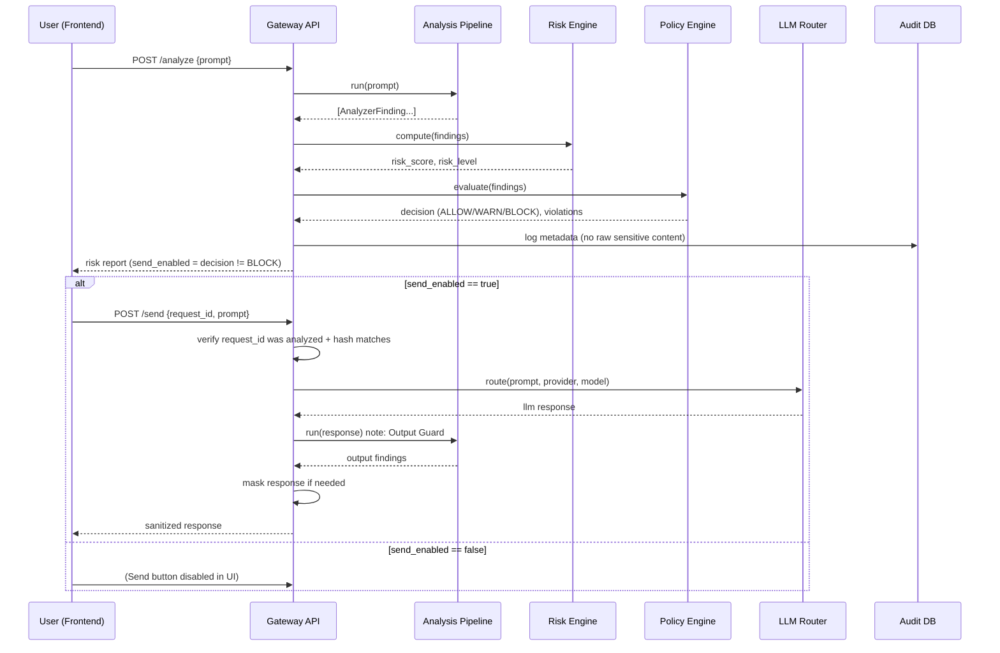
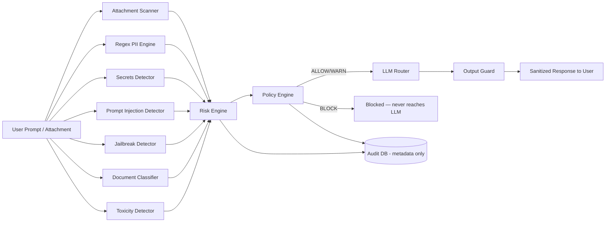

# Architecture

## Sequence: Analyze → Send

## Data flow

## Threat model (STRIDE-style, abbreviated)

| Threat | Mitigation in this project |
|---|---|
| Sensitive data (PII/PHI/secrets) sent to a third-party LLM | Regex PII engine + Secrets detector + Document classifier, enforced by Policy Engine before any LLM call |
| Prompt injection / instruction override | Prompt Injection Detector (heuristic phrase matching) |
| Jailbreak framing (DAN, dev-mode, roleplay bypass) | Jailbreak Detector, hard-BLOCK policy |
| Malicious file upload (macro, script, executable) | Attachment Scanner — extension allow/block-list + macro/script indicator scan |
| LLM response leaking sensitive data back to user | Output Guard — response is re-run through the same analyzer pipeline before being shown |
| Bypassing Analyze and calling Send directly | `/send` requires a prior `/analyze` `request_id` + prompt-hash match (Zero-Trust re-verification) |
| Sensitive prompts persisted in logs | Audit DB stores only entity *type names*, risk score, and decision — never raw prompt/attachment content |
| Unauthorized API access | `X-API-Key` header required on all gateway endpoints (swap for full JWT/RBAC in production — see roadmap) |

## What's implemented vs. roadmap (Phase 2)

**Implemented (works out of the box, no heavy ML downloads):**
Regex PII/PHI engine, Secrets detector, Prompt injection detector, Jailbreak detector,
Document classifier, Toxicity heuristic, Attachment/malware-indicator scanner, Risk engine,
YAML Policy engine, Auto-masking/remediation, LLM Router (Ollama + OpenAI-compatible),
Output Guard, SQLite audit logging, React frontend with Analyze/Send workflow, Docker Compose.

**Roadmap / Phase 2 (swap-in, same analyzer interface):**
- Microsoft Presidio + GLiNER + spaCy for statistical/NER-based PII detection (higher recall than regex alone)
- EasyOCR/Tesseract for scanned PDF/image text extraction
- Real AV/sandbox integration (ClamAV or cloud AV API) in the attachment scanner
- Postgres + Redis for production-scale storage, caching, and rate limiting
- Full JWT auth + RBAC (currently a single shared API key)
- Prometheus/Grafana/OpenTelemetry observability stack
- Kubernetes manifests / Helm chart
